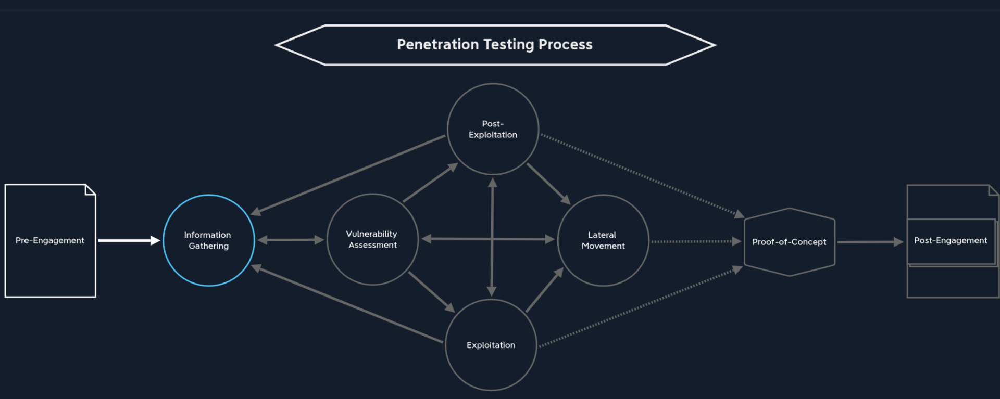

##########################################
Penetration Testing Process
##########################################

Penetration Testing Process Overview
^^^^^^^^^^^^^^^^^^^^^^^^^^^^^^^^^^^^^^^^^^

1. Pre-Engagement
========================================
   The process where essential documents, scope, tasks, limitations and agreements are documented **IN WRITING**. Contracts and essential information needed for pentesters and the client are drawn up, such as:

   1. Non-Disclosure Agreement
   2. Goals
   3. Scope
   4. Time Estimation
   5. Rules of Engagement

   Before any of the vital information can be discussed or meetings held, an NDA has to be signed by all parties.

   **Keep track of WHO's authorized to contract us for a penetration test.**  
   Usually, it's either the CEO, CSO, CISO or VP of Internal Audit, etc.  
   Also, keep a track of primary/secondary points of contact for escalating any issues.

Pre-Engagement Process - Stages Involved
###########################################
Now, let's talk about the stages involved in the Pre-Engagement Process:

.. list-table:: Pre-Engagement Stages
   :header-rows: 1

   * - Pre-Engagement Stages
   * - Scoping questionnaire
   * - Pre-engagement meeting
   * - Kick-off meeting

Before we begin, here is a list of documents to be prepared as part of the pre-engagement process:

.. list-table:: Non-Disclosure Agreement and Related Documents
   :widths: 40 60
   :header-rows: 1

   * - Document
     - Timing for Creation
   * - Non-Disclosure Agreement (NDA)
     - After Initial Contact
   * - Scoping Questionnaire
     - Before the Pre-Engagement Meeting
   * - Scoping Document
     - During the Pre-Engagement Meeting
   * - Penetration Testing Proposal (or Contract/Scope of Work (SoW))
     - During the Pre-Engagement Meeting
   * - Rules of Engagement (RoE)
     - Before the Kick-Off Meeting
   * - Contractors Agreement (Physical Assessments)
     - Before the Kick-Off Meeting
   * - Reports
     - During and after the conducted Penetration Test

2. Information Gathering
========================

Identifying targets (can be a list of IP addresses/network ranges or only a domain name). Using the information collected to look for any weaknesses. Using automated scanning tools like nmap, nessus, etc. to find known vulnerabilities and manual analysis.

**Before attempting to exploit anything, we should have completed thorough information gathering. Organization and patience are vital while being as thorough as possible.**

This stage can be divided into 5 categories:

.. list-table:: Information Gathering Categories
   :widths: 25 75
   :header-rows: 1

   * - Category
     - Description
   * - Open-Source Intelligence
     - Finding the target company's publicly available sensitive information (API keys, passwords, tokens, etc.).
   * - Infrastructure Enumeration
     - Gaining an overview of the infrastructure (external or internal), e.g. using DNS to map servers and hosts.
   * - Service Enumeration
     - Identify services that allow interaction with hosts or servers. Find vulnerabilities in old versions, misconfigurations, etc.
   * - Host Enumeration
     - Identify which OS and which services (plus versions) are present. Internal services may have hidden vulnerabilities.
   * - Pillaging
     - Extracting sensitive data from a system after post-exploitation access.

3. Vulnerability Assessment
====================================================

Divided into two stages:
   1. Scan for known vulnerabilities
   2. Analyze found vulnerabilities -- privilege escalation, workflow manipulation, etc.

There are 4 types of vulnerability analysis:

.. list-table:: Vulnerability Assessment Types
   :widths: 20 80
   :header-rows: 1

   * - Analysis Type
     - Description
   * - Descriptive
     - Summarizes a dataset's key features, helping spot errors or anomalies.
   * - Diagnostic
     - Digs into *why* things happened. Looks back for reasons and connections behind events.
   * - Predictive
     - Forecasts future probabilities, spotting trends and likely outcomes from current & past data.
   * - Prescriptive
     - Recommends specific actions to prevent issues or achieve results.

Understanding with an example
-----------------------------

Suppose we found an open TCP port 2121 on a host during the information gathering phase.

Other than the fact that this port is open, Nmap did not show us anything else. We must now ask ourselves what conclusions can be drawn from this result. Therefore, it does not matter which question we start with to make our conclusions. However, it is essential to ask precise questions and remember what we know and do not know. At this point, we must first ask ourselves what we see and what we actually have, because what we see is not the same as what we have:

- TCP port 2121. TCP means this service is connection-oriented.
- Is this a standard port? No; standard (well-known/system) ports are 0-1023.
- Are there any familiar numbers in this port? Yes, TCP port 21 (FTP). Admins often use "easy to remember" alternatives.
- Try to connect to the service using Netcat or an FTP client to confirm or disprove.
- If connection takes longer than usual (e.g. 15s), it may have configured delays. Use Nmap with ``--min-rtt-timeout=15s``.
- Confirming an FTP server is running on this port may explain a failed scan.

Websites that publish CVEs and PoCs:
    1. `CVEdetails <https://www.cvedetails.com/>`_
    2. `Exploit DB <https://www.exploit-db.com/>`_
    3. `Vulners <https://vulners.com/>`_
    4. `Packet Storm Security <https://packetstormsecurity.com/>`_
    5. `NIST <https://nvd.nist.gov/vuln/search?execution=e2s1>`_

**It is important to note that these two stages (Information Gathering and Vulnerability Assessment) often overlap, resulting in regular back and forth movement between them.**

4. Exploitation
===============

This is the stage where we look for ways to achieve our goal (escalated privileges, reverse shell, etc.) using found vulnerabilities.

Exploitation is divided into two AREAS:
   1. Network exploitation—Overview of the network, open ports/services, misconfigurations, leverage public vulns.
   2. Web exploitation—Web application attack surfaces, SQLi, LFI/RFI, etc., differences in DB syntax.

Attack preparation
------------------

- **No Good Exploit? Rebuild & Test Locally:**
  - If a working PoC exploit is missing, recreate the target environment locally (VM).
  - Mirror target components.
  - Adapt/test the exploit locally.
- **Familiar Vulns:**
  - For common issues, you'll know the right tool/exploit and its stability.
- **Communicate When in Doubt!**
  - Check with the client before risky attacks.
  - Provide all data for informed decisions.
  - If no exploitation, note in report: "not actively confirmed, but likely an issue."
  - Extra communication is better than downtime.
- **Post-Successful Exploit:**
  - Take clear notes, log activities.
  - Move to post-exploitation and lateral movement.

CVSS Scoring: `https://nvd.nist.gov/vuln-metrics/cvss` (for assessing vulnerability severity)

.. list-table:: CVSS Severity
   :widths: 30 70
   :header-rows: 1

   * - Severity
     - Severity Score Range
   * - None
     - 0.0
   * - Low
     - 0.1-3.9
   * - Medium
     - 4.0-6.9
   * - High
     - 7.0-8.9
   * - Critical
     - 9.0-10.0

NVD Calculator: `https://nvd.nist.gov/vuln-metrics/cvss/v3-calculator`

5. Post-Exploitation
====================

In most cases, exploiting services does not grant the highest privileges. **This stage is to bypass restrictions and gain privileges.**  
With gained privileges, repeat information gathering or move laterally/exploit other services.  
May involve:

- Evasive Testing (e.g. commands monitored by EDR: ``net user``, ``whoami``; types: Evasive, Hybrid Evasive, Non-Evasive)
- Information Gathering
- Pillaging (examine host’s network role)
- Vulnerability Assessment
- Privilege Escalation
- Persistence
- Data Exfiltration

  - When testing exfiltration, remember DLP, EDR, encryption are common defenses.
  - **CRITICAL:** Always get client and manager approval before exfiltrating any sensitive data.
  - **Safer Bet:** Use bogus data (fake credit cards, etc.) to test.
  - If using fake data, confirm with client if systems should detect that type.
  - **Evidence is key:** Use screen recordings and screenshots for vital steps.
  - If terminal-only: capture hostname, IP, user, and file path to prove access.
  - **If you exfiltrate sensitive data:** Notify client immediately. They may pause, end, or shift the test, but it's their call.

**Pillaging is about extracting info from the compromised system, learning about its connections, and is different from unauthorized data exfiltration.**

6. Lateral Movement
===================

(Section intentionally left as a heading, as in original MD.)

7. Proof-of-Concept
===================

(Section intentionally left as a heading, as in original MD.)

8. Post-Engagement
==================

(Section intentionally left as a heading, as in original MD.)

Summary: https://academy.hackthebox.com/module/90/section/936

::

   Gather info
   ↓
   assess vulnerability and gain access to target system -> if access is not the highest, get highest access first
   ↓

***

**ALWAYS REMEMBER:** do your due diligence BEFORE asking for help. Try to come up with a partial solution first. Before asking a question, list out what you already know and what things you have already tried. In doing this, you may find the answer is right in front of you.

**A pentest is not monitoring the IT infrastructure or systems but a momentary snapshot of the security status**

***

Penetration Testing Methods
===========================

1. **External** — Performed from outside, as an anonymous user on the Internet.  
   Conducted from own host or VPS, possibly using VPN for stealth. Client may request "stealthy" or "hybrid" approaches.

   *Goal*: Access external-facing hosts, obtain sensitive data, or gain access to the internal network.

2. **Internal** — Performed from within the corporate network.  
   Can start from an assumed breach or after accessing from an external test.

.. list-table:: Penetration Testing Types
   :widths: 20 80
   :header-rows: 1

   * - Type
     - Information Provided
   * - Blackbox
     - Minimal. Only essentials, such as IPs and domains.
   * - Greybox
     - Extended. Additional info such as URLs, hostnames, subnets, etc.
   * - Whitebox
     - Maximum. Full internal view, possibly including source code, admin credentials, configs, etc.
   * - Red-Teaming
     - May include physical testing and social engineering, can be combined with above types.
   * - Purple-Teaming
     - Focuses on working closely with defenders; can be combined with other types.

Scoping Questionnaire
^^^^^^^^^^^^^^^^^^^^^^^^^^^^^^^^^^^^^^^^^^^^^^^^^^^^^^^^^^^^^
Used to create the Scoping Document

Asking the right questions
================================
Asking the right questions is crucial to ensure the penetration test is effective and meets the client's needs. Below are some key questions to consider. Ask clients to choose one or more out the following : 

☐ Internal Vulnerability Assessment  ☐ External Vulnerability Assessment

☐ Internal Penetration Test          ☐ External Penetration Test

☐ Wireless Security Assessment       ☐ Application Security Assessment

☐ Physical Security Assessment       ☐ Social Engineering Assessment

☐ Red Team Assessment                ☐ Web Application Security Assessment

Other info needed 
==================
- How many expected live hosts?	
- How many IPs/CIDR ranges in scope?	
- How many Domains/Subdomains are in scope?	
- How many wireless SSIDs in scope?	
- How many web/mobile applications? If testing is authenticated, how many roles (standard user, admin, etc.)?	
- For a phishing assessment, how many users will be targeted? Will the client provide a list, or we will be required to gather this list via OSINT?	
- If the client is requesting a Physical Assessment, how many locations? If multiple sites are in-scope, are they geographically dispersed?	
- What is the objective of the Red Team Assessment? Are any activities (such as phishing or physical security attacks) out of scope?	
- Is a separate Active Directory Security Assessment desired?	
- Will network testing be conducted from an anonymous user on the network or a standard domain user?	
- Do we need to bypass Network Access Control (NAC)?

Information Disclosure and Evasiveness 
========================================
- Is the Penetration Test black box (no information provided), grey box (only IP address/CIDR ranges/URLs provided), white box (detailed information provided)

- Would they like us to test from a non-evasive, hybrid-evasive (start quiet and gradually become "louder" to assess at what level the client's security personnel detect our activities), or fully evasive.

Contract Checklist  
^^^^^^^^^^^^^^^^^^^^^^^^^^^^^^^^^^^^^^^^^^^^^^^^^^^^^^^^^^^^^
Used to Create the Penetration Testing Proposal / Scope of Work (SoW)  

Summary:
-----------------
The information gathered during the **pre-engagement meeting**—combined with responses from the scoping questionnaire—is used to define the Penetration Testing Proposal, also referred to as the Contract or Scope of Work (SoW).

.. list-table:: Contract - Checklist
   :widths: 24 76
   :header-rows: 1

   * - Checkpoint
     - Description
   * - Non-Disclosure Agreement (NDA)
     - Secrecy agreement to keep project information confidential. Must be signed before or during the initial meeting prior to discussing sensitive details.
   * - Goals
     - Define major and minor objectives to be achieved during the engagement; set milestones.
   * - Scope
     - Clearly list and authorize all targets (e.g., domains, IPs, systems); legal approval prioritized.
   * - Penetration Testing Type
     - Decide on the type of penetration test after reviewing options, their pros/cons; make recommendations but let the client choose.
   * - Methodologies
     - Agree on testing frameworks/standards (e.g., OSSTMM, OWASP), manual and automated procedures, exploitation techniques.
   * - Penetration Testing Locations
     - Define testing locations such as external (remote/VPN) and/or internal (onsite/remote/VPN).
   * - Time Estimation
     - Set start/end dates for testing, specify timing for different phases, and clarify in or outside business hours.
   * - Third Parties
     - Identify all third-party providers in scope; confirm and document written permissions for testing.
   * - Evasive Testing
     - Decide whether to employ techniques to evade or bypass security controls, based on client wishes.
   * - Risks
     - Discuss possible risks and consequences with the client, set limitations and implement precautions.
   * - Scope Limitations & Restrictions
     - Identify critical systems which must not be affected; document off-limit components.
   * - Information Handling
     - Address all compliance requirements (e.g., HIPAA, PCI DSS, FISMA/NIST).
   * - Contact Information
     - Gather names, job titles, emails, phone numbers, and define escalation paths.
   * - Lines of Communication
     - Specify official channels for updates, issues, and escalation (e.g., email, phone, meetings).
   * - Reporting
     - Set expectations for report content/structure, delivery format, and if results presentation is needed.
   * - Payment Terms
     - Establish pricing, invoicing process, and payment schedule.
     
Rules of Engagement
^^^^^^^^^^^^^^^^^^^^^^^^^^^^^^^^^^^^^^^^^^^^^^^^^^^^^^^^^^^^^
.. list-table:: Rules of Engagement - Checklist
   :widths: 24 76
   :header-rows: 1

   * - Checkpoint
     - Contents
   * - Introduction
     - Description of this document.
   * - Contractor
     - Company name, contractor full name, job title.
   * - Penetration Testers
     - Company name, pentesters full name.
   * - Contact Information
     - Mailing addresses, e-mail addresses, and phone numbers of all client parties and penetration testers.
   * - Purpose
     - Description of the purpose for the conducted penetration test.
   * - Goals
     - Description of the goals that should be achieved with the penetration test.
   * - Scope
     - All IPs, domain names, URLs, or CIDR ranges.
   * - Lines of Communication
     - Online conferences or phone calls or face-to-face meetings, or via e-mail.
   * - Time Estimation
     - Start and end dates.
   * - Time of the Day to Test
     - Times of the day to test.
   * - Penetration Testing Type
     - External/Internal Penetration Test/Vulnerability Assessments/Social Engineering.
   * - Penetration Testing Locations
     - Description of how the connection to the client network is established.
   * - Methodologies
     - OSSTMM, PTES, OWASP, and others.
   * - Objectives / Flags
     - Users, specific files, specific information, and others.
   * - Evidence Handling
     - Encryption, secure protocols.
   * - System Backups
     - Configuration files, databases, and others.
   * - Information Handling
     - Strong data encryption.
   * - Incident Handling and Reporting
     - Cases for contact, pentest interruptions, type of reports.
   * - Status Meetings
     - Frequency of meetings, dates, times, included parties.
   * - Reporting
     - Type, target readers, focus.
   * - Retesting
     - Start and end dates.
   * - Disclaimers and Limitation of Liability
     - System damage, data loss.
   * - Permission to Test
     - Signed contract, contractors agreement.

Contractors Agreement
^^^^^^^^^^^^^^^^^^^^^^^^^^^^^^^^^^^^^^^^^^^^^^^^^^^^^^^^^^^^^
Suppose we encounter employees with a very high-security awareness during the physical attack and social engineering attempts, and we get caught. In that case, the employees will, in most cases, contact the police. This additional contractor's agreement is our "get out of jail free card" in this case.

.. list-table:: Contractors Agreement - Checklist for Physical Assessments
   :widths: 30 70
   :header-rows: 1

   * - Checkpoint
     - Description
   * - Introduction
     - Brief description of the document and its purpose in legal protection for the contractor during physical assessments.
   * - Contractor
     - Company name, contractor's full name, and job title.
   * - Purpose
     - Explanation of why the physical assessment is being conducted.
   * - Goal
     - Key objectives of this particular physical penetration test.
   * - Penetration Testers
     - Full names and affiliations of authorized penetration testers involved.
   * - Contact Information
     - Mailing addresses, emails, and phone numbers for contractors and client stakeholders.
   * - Physical Addresses
     - List of locations and sites in scope for assessment.
   * - Building Name
     - Specific buildings to be tested within the physical addresses.
   * - Floors
     - Details of which floors are included in the assessment.
   * - Physical Room Identifications
     - IDs or descriptions of individual rooms in scope.
   * - Physical Components
     - Physical assets, systems, or areas subject to testing (doors, access points, etc.).
   * - Timeline
     - Start and end dates/times for the physical assessment window.
   * - Notarization
     - Requirement for the agreement to be signed and/or notarized as official legal protection.
   * - Permission to Test
     - Confirmation of formal, written authorization to conduct the assessment (“get out of jail free card”).

Non Disclosure Agreements (NDA)
^^^^^^^^^^^^^^^^^^^^^^^^^^^^^^^^^^^^^^^^^^^^^^^^^^^^^^^^^^^^^
There are 3 types of NDAs:

.. list-table:: Types of NDAs
   :widths: 20 80
   :header-rows: 1

   * - Type
     - Description
   * - Unilateral NDA
     - This type of NDA obligates only one party to maintain confidentiality and allows the other party to share the information received with third parties.
   * - Bilateral NDA
     - **In this type, both parties are obligated to keep the resulting and acquired information confidential. This is the most common type of NDA that protects the work of penetration testers.**
   * - Multilateral NDA
     - Multilateral NDA is a commitment to confidentiality by more than two parties. If we conduct a penetration test for a cooperative network, all parties responsible and involved must sign this document.